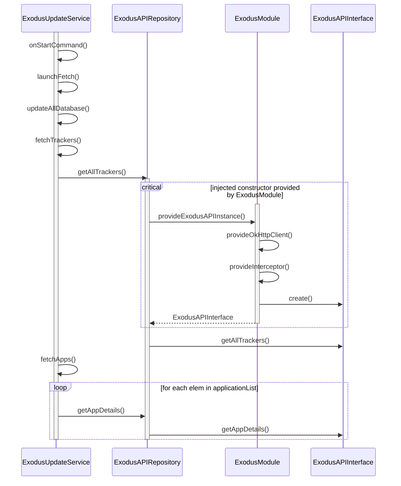

[Link to live](https://mermaid.live/edit#pako:eNqdVE1PwzAM_StRTiCNP9DDpImBQGICMbj14iUuC6RJSNyJCfHfcVc-uq0doz1EjWM_O88vfpfKa5SZTPhaoVM4NfAUoRT1l7t6DRDJKBPAkbh487pKj0ED4Rzjyijsc5rcXd9j8MmQj-s-pxkv9hDEtSOMBXynAUVmxbn7C-k4EGfjcZc9E97NibOe-7IEp09OB0BYqJxaXiKp5aD4arOdWDsFggUkHIRS1PkfIqgXjOk4hK3-ZOIJiYv4hfjt_w7nHX1V0XDnwArjnlERaqG8SxQrxT4iRL8ymo2LdUfXd9DbRx35WvU3ntk3fEsxiYCFvM1C490ffvtyRRTOrUFH_4vcKFRh4PL-CGzLOWPSkK_dHdLbpb53ofEAj-j0MYRul7erh6GinITwE229D6JgSXC1S4EWS1aMgBAsq4eMdzcm0UDthjBFAmN3Sj3-snsAP7TtkdsxdvZ8Op6JHMkSYwlG87x9r225pCWWmMuMfzUWUFnKZe4-2BUq8vO1UzLjh4Qj2QyKr_EsswJsYivqOsGsmeGbUf7xCfJTDBU)

