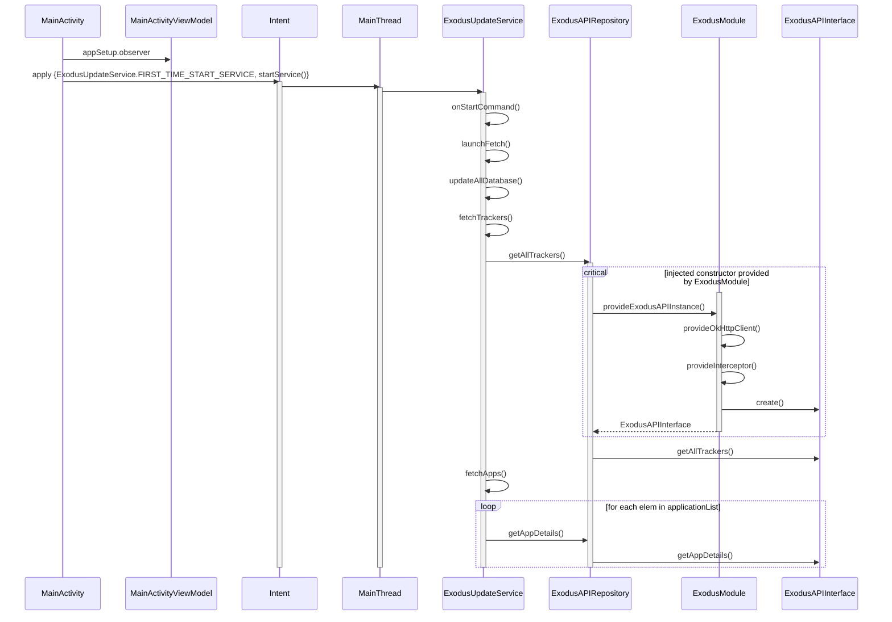

[Link to live](https://mermaid.live/edit#pako:eNqdVcGO2jAQ_RXLp12J7gfksBICVkUqakXSPSGhwR4WF8d2HYcWIf69E7ILITgsJafEfvP8ZvJmvOPCSuQJL_B3iUbgUMGbh3xmGD0OfFBCOTCBTUCZvghqo8L2-u6rwj8TYtWXsLEJaEI8PFt5BHm5N_prZVn8dBICpug3SmAXqP9jPEVnCxWs33aBSFqpr1FUIv0SPo5ppsa-PD_Hc00YOJdiKN2TXRQkE31HeF2DA15v2S6S3tPLeJpm82w8Gc3TrD_N5ulo-joejHqsCKT4HfbwuK-PgIqews_KW78fBdfVTVgrol340_chMiIuYW2Ozh8U2ehmtSatchvYPAcjHx7voNBQGrF6wSBWd8WXh8--1kMIsIAC72JZVudnHsQafXEbw5lvE_aGgUScKCqCaM0jfhdekaNBM2V-oQgombCmCL4UhGHO242StLjYRrqhxd7cipzX0F8jkw_6RieRX41o1bFGd4d_X38NwQ20Iv_-X-ShcwU6kvdJYLPNEyoaUtrxkM6_1DUvJF6pIxp5S0HP5bX9cK8p-84do7W1ji3JEqR2xVBjTo45zCRyT1DWfFNFuNO7zg0xgNItqbcne0FwLNtFcSNj5wITaZMGpjk0G8unSch7PEefg5J0T-4q4IyHFeY44zRPuQS_nvGZ2RMOymDTrRE8oY7DHq8nyvudypMl6IJWUVZKJvXFe7h_9_8A9falVg)

