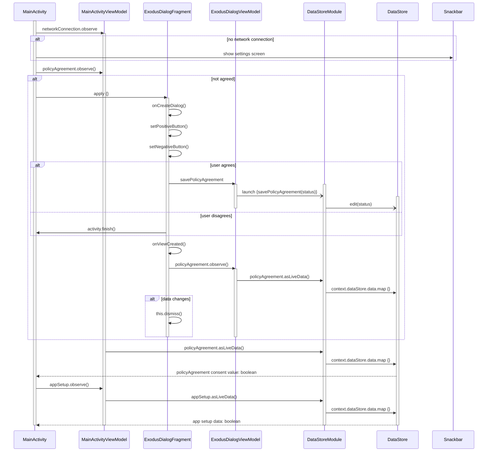

[Link to live](https://mermaid.live/edit#pako:eNrFVk1v2zAM_SuCTg2Q5gf4UKBrt9MyFAiwky-MzTpCbMmTqKRBkP8-Kp5dz1-Ne9h8iSEyj098T7TOMjEpykg6_OVRJ_isILNQxFrwU4IllagSNIk1KP2YkDooOk1Hfyo8rhk176d9fTOpd1wjN9k3C1mBmqazJsCegWBDxiLHfY4TCVUIAj8gHNhKe0XcPzwM7ycSGulo7P7JaI0cNXpltg7tYapCZweQk9CmRhJJAzXCZKMh2W_BRsLtzFE4JFI6c8IlFvHPn1CnYt5GSpOr5PSYMUbQoN7G3aJNkgSEhHQEekjMSEBZ5idxvnQ6Mq78UGQC3-gni4xYrdeEZ4JwF1-MU8wNv3gioz-P8wMz6OOEBnpuadVBNwO8JZKDA778LdREV7s-q3M6x0R88PSpNsDiftFFi0QOXic7cR4ge-cIyLvFZYxRtd4l2K4SCUxVA1Tlp3jL_jF3WEmQKneTCm2DRxVbflu9Kq3crhaWj9onbRv4VdZNZ7ltxqm9oS0jwnLNnrLdauC-s89DWl2wp1wbJgqzjfCNVmm9dH1bFVC-zwc-J2FRJDvQ2ayD8t5b2im3YpUL5VxLp49dfpuTRrIaYg1c443Bofv_mtxki_u-zzsEAp4LvwfIPcNvjckR9LyvC38DNki-7Bp0Rl8aiH_eEK4c5rovr8bsdKDlhc4UG4q0Lyat-MTtYCQr1nIpC7QFqJQva-eQHEvasWSxjPg1BbuPZawvnAeezOakExmR9biUvkyr72W42MnoFXgyLmWYq8auq9vf9RJ4-Q3hGH_r)

