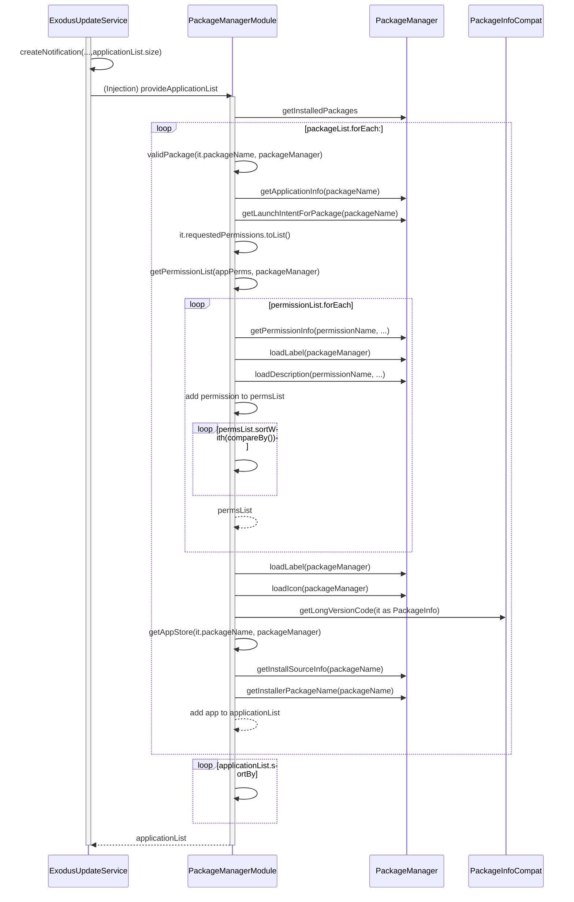

[Link to live](https://mermaid.live/edit#pako:eNq1Vttu2zAM_RVDTw6Q-QP8UGC9DAiQFAOCbS9-4SQm0WpLnkQHy4r--yhfkrS108Zd_GBAEnlIHl6kRyGtQpEKj78rNBJvNawdFJmJ-CvBkZa6BEPR3R-rKv-tVEC4RLfVEl8LfQX5AGtcgOG_W7BG_qbU4PnMrOyNLUqgRgQk6S1bH3al5yD6dHXVt59G0iEv7y3plZZA2po4SZIplGXerufaU-L1X5ychu-LOo3imfmFMuBMotLZrVb4-Tn2i7CGyes76bGcRmukmfEEeY6qPfMNRG5tySTXW3VcK-vuQG7Ssyx0sW0h152BWFPSAt9DgdPOSqsyOT-EI5pCDcRH6CPQ5lAZuZkZQkNfrOu8Hg3accBhu9A0nphrdIX2nh32CdnAbzwOlP09YNU4XI9hxw_w2uT1mUqX2vOpOphueN8vm8Rye5zLf25BzeEn5vHHqiLg3KKXTpd1p37YtY5wUOqIvohsvfKH9twT7JtxYB390LSJZZhMDq938WSc5UYJjTqlPaz-ws03cC6cmpkMORkDcxjyTbNas_6OLuTihi8mni0R-GPZ0W3FQ2VJ1l1gXLUTd2krJ_E_DKxugnejKsC8G_J0pfMwCSUOfffQvoLqin91DXLdX-8uW-i913SvrwrfcWseCfW-GMRUFNxEoBW_fx6DTiZogwVmgp0WCtxDJjLzxHJQkV3ujBQpuQqnoqqR2reSSFeQe95FpbnCFs2Dqn5XPf0DFVFQDA)

