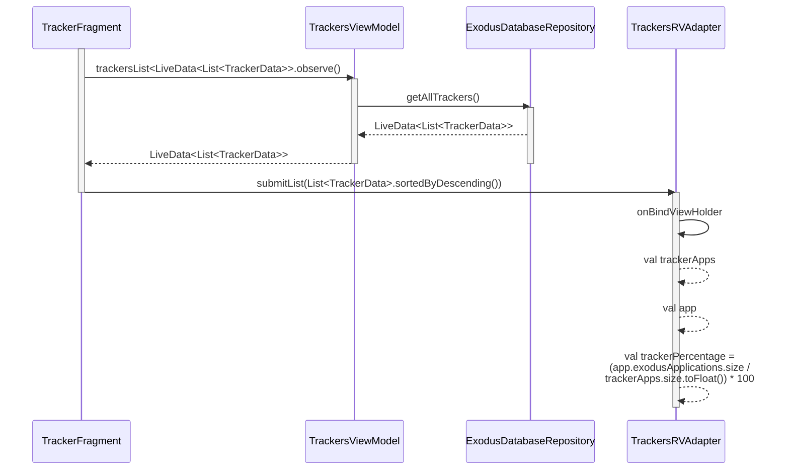
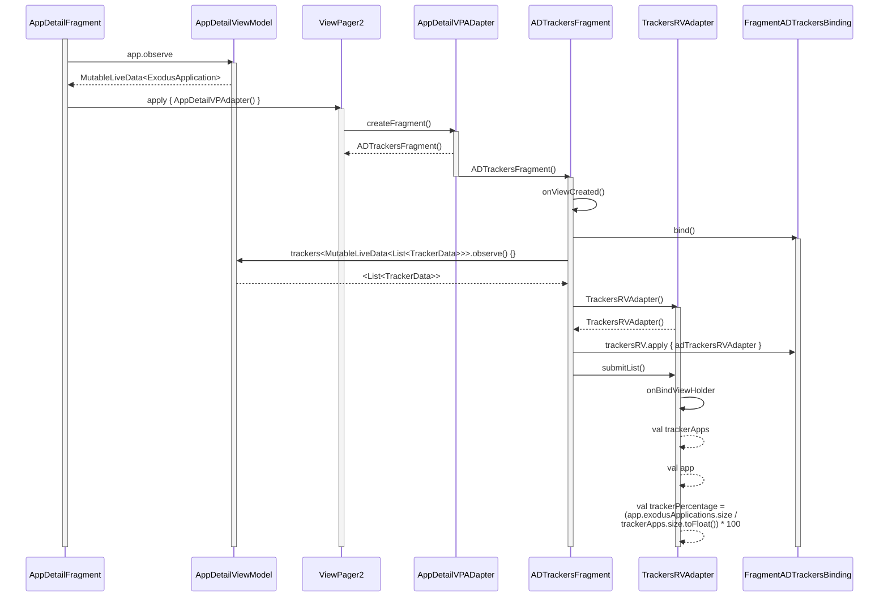

# Data Flow of Tracker Data to UI

## From Tracker Fragment
[Link to Live](https://mermaid.live/edit#pako:eNqlVMFOwzAM_ZUopw1tBa7VqDQ0EAeQEKCdenEbUyLaJCRuYUz7d9JuQ2NdJgTtpXl9tp-dJy95rgXymDt8q1HlOJNQWKhSxfxjwJLMpQFF7MlC_or22kJRoaIgwc0lvt_5pGWfcvWhRe1mQJCBwwc02knSdhFO9jCfCjCEdk2BnGQDhIfV7IFsnCR9VTGjDXQrHU1uZYOtoEl32rBbIEkinTm0DQ6Gh4vvd9qDOwGhnmNWIE3LchvVq3J8WKG_bBzo-kijQfk7qbZD_UUigb_sYYd4fKQHb_TbGjFzdVZJavUMeqIipy2huFzM0OWohFTFYDgMCfhpqJ68PTv24JBArS6lEm1zN7oUR8ID8Q2UW9tOjXF_CQdj_lH1Hq0fHkGB7GKS2YQNfL4Iu-v1ikqZA0mtXOTkJ7LTjrIjuIMj0telBvLjZyfs_Ows6IKdMbcvH_EKbQVS-EW1bKNSTi9YYcpj_ynAvqY8VSvPg5r040LlPCZb44jXRvjEm6XG42conUdRtC68W2--bgGuvgAE9sl7)

## From App Detail Fragment
[Link to Live](https://mermaid.live/edit#pako:eNqlVlFvmzAQ_iuWn5KpTbs9ogwpK6v20EjRNvWJlwNfM6tgM2OydRH_fQZCQ7AN6paHiFy-u_vuu_PhI00lQxrQEn9WKFKMOOwV5LEg5lOA0jzlBQhNNkURoQae3SvY5yj0BOSR46-tiZvZmOavHexRfZjy320iKDQqByb6riB9RlX6efSIr48b5gnTO5_DfeKCcbHvoJBqfgCNvqotM7kOQ0f9AYGiWMmkRHVAX-iRWradXF9E73MGZFtpSDJ84AeMQMP682_JqtIAM56C5lKEU3TPrWhpZi_keNGCTrvFktQj5uMenn-PZOjbGJBUofHs0y-WXi0uO2_bOy2G1O2J6MO7vBt-lsNUEIazLM8Az3Dadi8RKZra7lq52Gshbn_vEAckMQ-WyjND72PpmGp9Aq7HE_jAS70-hWkMYRj2428G6VjPjLhDEEfISbrW4Q9sk6WMZ2NYZj9Nb463906_hlr1xxKYTaV-qwxlleRcN3L23Bz1uV2laNg13foiMzYjj8P_AFlflul9-S_uRor_yLpDlRppzMogH9eJCsmiWcw43pflquR_kNy0kAHh1rzS8j6TYNRbknfk_e2ttSBmDtgA6Rm44bLx7JIBZLyHXavK6-x6_XSg7pte0RxVDpyZ28GxscVU_8AcYxqYRwbqOaaxqA0OKi2_vYiUBlpVeEWrgpkMp5sEDZ4gK40VGddSbbvrRnvrqP8C9tf1Lw)

